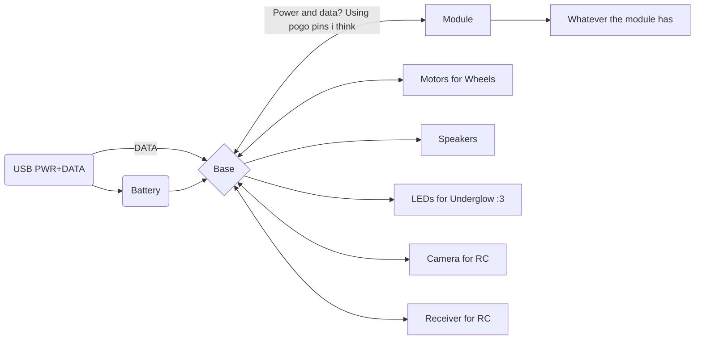

> [!NOTE]
> You should check git blame if you want dates

# Day 1

I'm starting this out with no idea where to begin, just created a KiCad Project and making this to procrastinate starting because i don't know how.
I'm in a workshop for like 2 weeks so it will help having assistance and tools.

Laying out the ideas i wrote yesterday for myself here:
- For EMF
- Orpheus but it can move
- maybe i can make it multiple skins, and also for some reason i wanna do something with the mouth
- lights, maybe laser eyes, i dont know something
- it needs to have stuff to do with space
- speakers ofc
 
Found this in the slack:
https://drive.google.com/file/d/1XOK61L42DCuCZ-fIZa7nPpmETFr9BhX6/view
https://hackclub.slack.com/archives/C01D7AHKMPF/p1716862590424649?thread_ts=1716861692.725909&cid=C01D7AHKMPF

He said it was okay to use for stuff (see slack link) so i think i should be good? ill probably ask still but for now it'll do.

I'm thinking of a modular system where I have a base and i can clip the thing to have different orpheuses

I should make an Orph with a space suit or smth and an orph in a rocket and one dancing in the stars because stardance